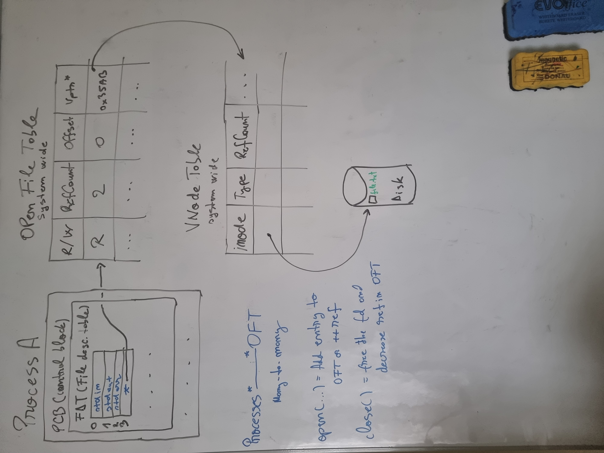

***What happens when we call fopen , fclose
When called, fopen allocates a FILE object on the heap. Note that the data in a FILE object is undocumented - FILE is an opaque struct, you can only use pointers-to-FILE from your code.
The FILE object gets initialized. For example, something like fillLevel = 0 where fillLevel is the amount of buffered data that hasn't been flushed yet.
A call to the filesystem driver (FS driver) opens the file and provides a handle to it, which is put somewhere in the FILE struct.

To do this, the FS driver figures out the HDD address corresponding to the requested path, and internally remembers this HDD address, so it can later fulfill calls to fread etc.

The FS driver uses a sort of indexing table (stored on the HDD) to figure out the HDD address corresponding to the requested path. This will differ a lot depending on the filesystem type - FAT32, NTFS and so on.

The FS driver relies on the HDD driver to perform the actual reads and writes to the HDD.

A cache might be allocated in RAM for the file. This way, if the user requests 1 byte to be read, C++ may read a KB just in case, so later reads will be instantaneous.

A pointer to the allocated FILE gets returned from fopen.

After a call to fclose , the FILE* (mem addr, read/write possitions etc) structure is destroyed. 

